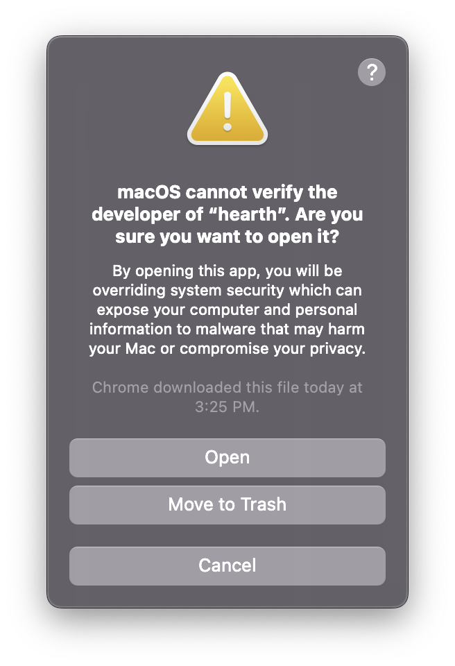
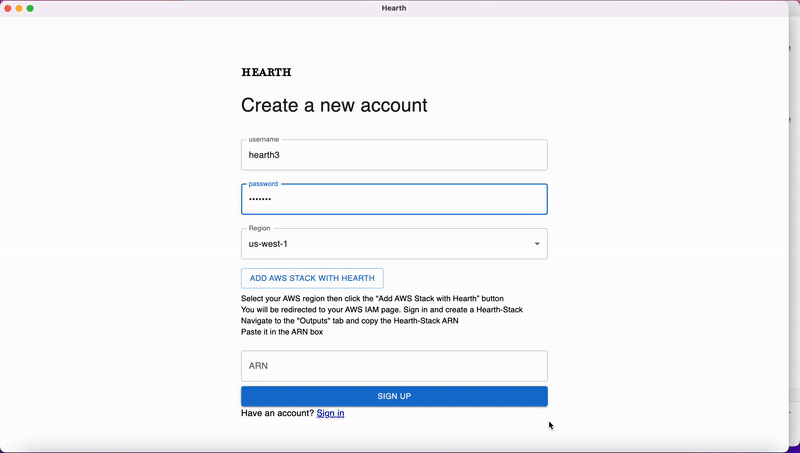
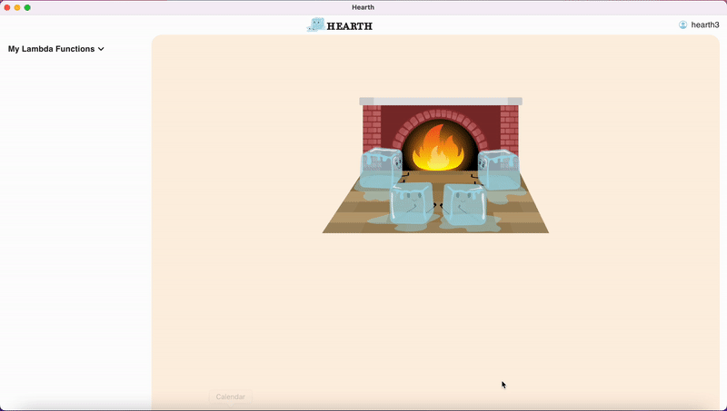
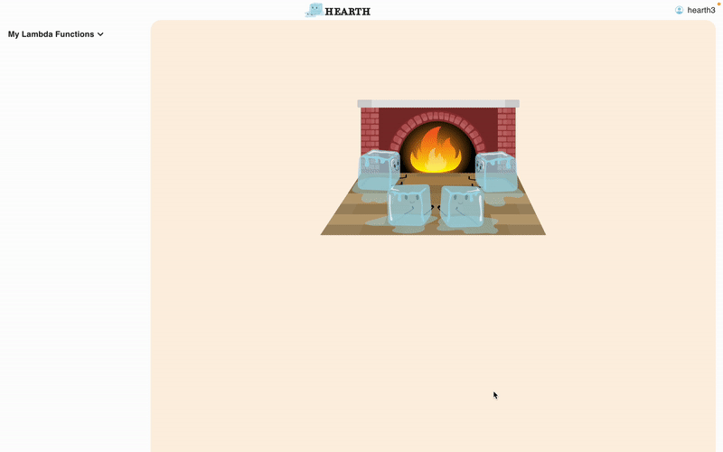

<div align="center">

<h1>Hearth</h1>
</div>

## Overview

When looking for relevant issues in the current software engineering landscape, specifically with AWS Lambda, our team reached out to different software engineers at Amazon to try and identify potential problems. Their response was unanimous: cold starts. Cold starts are a side effect of having a serverless architecture platform like Lambda, and they happen when a function is not invoked for a certain period of time. After that time period, the function becomes “cold” and requires a significantly longer time frame to run again(generally from 100ms to 1 second). This happens because the Amazon servers stop keeping the code ready in order to maintain efficiency, however cold starts can end up causing issues for developers in testing and in production. Tests will often fail because of cold start latency delays and if they happen in production the user will have much more lag than usual in using a product, which could end up costing a business money if they decide to leave a website, for example.

So what was our solution to assist developers in combating cold starts? Hearth. Hearth is a desktop application that helps developers using AWS Lambda to prevent and monitor cold starts through timed invocation and data visualization specifically tailored to assist in combating the cold starts. In Hearth, not only can you set a custom timer for each Lambda function individually from anywhere between one and sixty minutes, you can also see important information from recent invocations of each function such as duration (including cold start time if applicable), billed duration, and maximum memory usage. Developers are also given a parsed and formatted list of recent CloudWatch logs for a selected Lambda function which allows them to monitor key metrics as they pertain to cold starts in order to make informed decisions on when they should invoke their functions to avoid them. With all of these capabilities, we’re confident that Hearth is a tool that will help developers fight against the cold starts.

## Getting Started

### Installation and Setup

Please follow the steps to get started:

1. Download Hearth [here](https://www.hearthlambda.io).

   MacOS:

   1. Double click to unzip and open the 'hearth-darwin-x64-1.0.0.zip' file.
   2. Right click to open Hearth. **Do not double click the application**.
   3. Click 'open' on the pop up window to launch Hearth.
   <p>
     
   </p>

2. For existing users: login with your existing username and password.
3. For new users: click "Sign up" to create a new account.
4. Create a Hearth stack with AWS Cloud Formation.
5. Copy and Paste the unique Hearth Delegation Role ARN generated from step 4.
6. Login with the newly created credentials.

<p>

</p>

<br/>

## Keep Your Functions Warm and Visualize Metrics

Once the application is running, click on the "My Lambda Function" dropdown to view your Lambda functions. Select the function you would like to keep warm, and select how often (in minutes) to warm the function by dragging the slider or manually inputting a number.

<p>

</p>

Select a function to view its logs and visualize its metrics in the sidebar on the left. This will display graphs and a log table of up to ten of the most recent invocations.

<p>

</p>

<br/>

## Contribute

Here at Hearth we are always open to ways to improve our application. If you would like to contribute to the open source community, follow the steps below to submit your ideas and/or bug fixes to the team:

- Fork this repository to your GitHub account.
- Clone the repository.

```
git clone https://github.com/oslabs-beta/hearth.git
cd hearth
```

- Create a feature branch.

```
git checkout -b <your-name/new-feature>
```

- Add your changes.

```
git add .
```

- Commit your changes.

```
git commit -m “your commit comment here”
```

- Push your feature branch to your remote repo.

```
git push origin [your-name/new-feature]
```

- Submit a pull request, and a member of our team will review and merge the changes as soon as possible!

<br/>

## Meet the Team

- Linda Ngo - [LinkedIn](https://www.linkedin.com/in/lindango14/) | [GitHub](https://github.com/lindango142)
- Andy Oh - [LinkedIn](https://www.linkedin.com/in/andyseihyunoh/) | [GitHub](https://github.com/andyyohh)
- Christina Phung - [LinkedIn](https://www.linkedin.com/in/christinaphung/) | [GitHub](https://github.com/christinaaphungg)
- Jay Cheskis - [LinkedIn](https://www.linkedin.com/in/jay-cheskis/) | [GitHub](https://github.com/jaycheskis)

<br/>

## License

Hearth is distributed under the MIT License.
